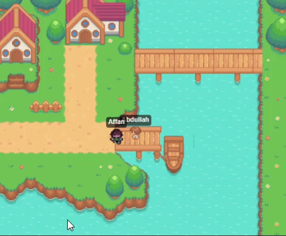

# Metaverse

Welcome to the Metaverse project! This is a web-based application that allows users to explore a virtual world, interact with other users, and play a game.



**Note:** This repository contains the frontend of the Metaverse project. The backend repository can be found [here](https://github.com/AbdullahMukadam/Metaverse_Backend).


## Technologies Used

*   **Next.js:** A React framework for building server-side rendered and static web applications.
*   **TypeScript:** A typed superset of JavaScript that compiles to plain JavaScript.
*   **Tailwind CSS:** A utility-first CSS framework for rapidly building custom user interfaces.
*   **Drizzle ORM:** A TypeScript ORM for SQL databases.
*   **Neon:** A serverless PostgreSQL database.
*   **Socket.io:** A library for real-time, bidirectional and event-based communication.

## Getting Started

To get a local copy up and running, follow these simple steps.

### Prerequisites

*   Node.js
*   npm

### Installation

1.  Clone the repo

    ```sh
    git clone https://github.com/AbdullahMukadam/metaverse.git
    ```

2.  Install NPM packages

    ```sh
    npm install
    ```

3.  Create a `.env` file and add the required environment variables.

4.  Run the development server

    ```sh
    npm run dev
    ```

## Folder Structure

```
.
├── public
└── src
    ├── app
    │   ├── (auth)
    │   │   ├── signIn
    │   │   └── signUp
    │   ├── dashboard
    │   ├── game
    │   └── ...
    ├── components
    ├── db
    ├── lib
    └── utils
```

## Contributing

Contributions are what make the open source community such an amazing place to learn, inspire, and create. Any contributions you make are **greatly appreciated**.

1.  Fork the Project
2.  Create your Feature Branch (`git checkout -b feature/AmazingFeature`)
3.  Commit your Changes (`git commit -m 'Add some AmazingFeature'`)
4.  Push to the Branch (`git push origin feature/AmazingFeature`)
5.  Open a Pull Request

## License

Distributed under the MIT License. See `LICENSE` for more information.
